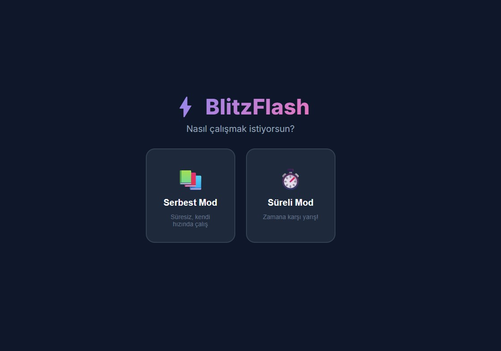

# ⚡ BlitzFlash - İngilizce Kelime Öğren

Hızlı ve eğlenceli bir şekilde İngilizce kelime öğrenmeni sağlayan interaktif flashcard uygulaması.



## 🎮 Oyun Modları

### 📚 Serbest Mod
Süre baskısı olmadan kendi hızında çalış. Flashcard'ları çevirerek kelimelerin İngilizce ve Türkçe karşılıklarını öğren.

- **Kart çevirme**: Tıkla veya Space/Enter tuşuna bas
- **Bildim**: Sağa kaydır veya → ok tuşu
- **Bilemedim**: Sola kaydır veya ← ok tuşu
- Tüm kelimeler bittiğinde doğruluk yüzdesi gösterilir

### ⌨️ Yazarak Tahmin (60 Saniye Modu)
60 saniyede kaç kelime bilirsin? Gösterilen kelimeye çevirisini yazarak cevap ver.

- Rastgele İngilizce veya Türkçe kelime gösterilir
- Çevirisini yazıp **Enter** veya **Kontrol Et** butonuna bas
- İlk cevabınla birlikte **60 saniyelik geri sayım** başlar
- Birden fazla anlamı olan kelimeler için herhangi birini yazmak yeterli
- Süre dolduğunda doğru sayın **skor** olarak kaydedilir
- **🏆 Skor Tablosu**: En iyi 10 skorun localStorage'da saklanır

### 📝 Cümle Tamamla
Boşluklu İngilizce cümlelerde doğru kelimeyi 4 seçenek arasından bul.

- Cümledeki boş kelimeyi tahmin et
- Doğru/yanlış cevaptan sonra Türkçe çeviri gösterilir
- Seçeneklerin altında Türkçe anlamları da listelenir

## 📊 Kelime Havuzu

Toplam **517 kelime** — temel İngilizce kelimeler, örnek cümleler ve Türkçe karşılıklarıyla birlikte.

| Dosya | İçerik |
|-------|--------|
| `words.js` | Ana kelime listesi |
| `words_part1.js` – `words_part7.js` | Ek kelime paketleri |

Her kelime objesi şu bilgileri içerir:
```javascript
{
    english: "Word",
    turkish: "Kelime",
    englishSentence: "Example sentence with the word.",
    turkishSentence: "Kelimeyi içeren örnek cümle."
}
```

## 🛠️ Teknolojiler

- **HTML5** — Sayfa yapısı
- **CSS3** — Dark tema, glassmorphism, animasyonlar
- **Vanilla JavaScript** — Oyun mantığı, localStorage
- **Google Fonts** — Inter font ailesi

## 🎨 Tasarım Özellikleri

- 🌙 Premium koyu tema
- 🔮 Glassmorphism efektleri ve gradient orb animasyonları
- ✨ Kart çevirme, kaydırma ve geri bildirim animasyonları
- 📱 Mobil uyumlu (responsive) tasarım
- 👆 Dokunmatik kaydırma desteği

## 🚀 Kurulum

Herhangi bir bağımlılık veya build adımı yok. Doğrudan çalışır:

```bash
# Projeyi klonla
git clone <repo-url>

# index.html dosyasını tarayıcıda aç
start index.html
```

## 📁 Dosya Yapısı

```
BlitzFlash/
├── index.html          # Ana sayfa
├── style.css           # Tüm stiller
├── app.js              # Oyun mantığı
├── words.js            # Ana kelime listesi
├── words_part1-7.js    # Ek kelime paketleri
└── README.md           # Bu dosya
```

## 📝 Lisans

Bu proje kişisel eğitim amaçlı geliştirilmiştir.
