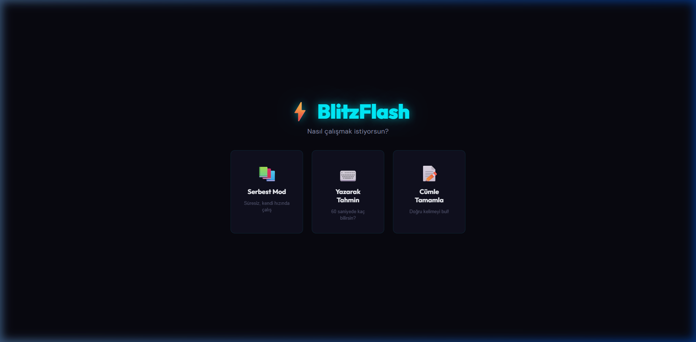
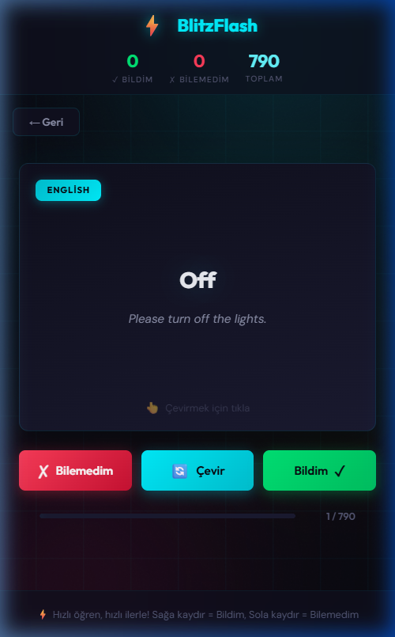
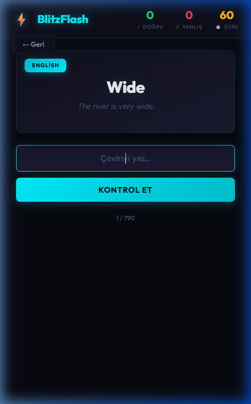
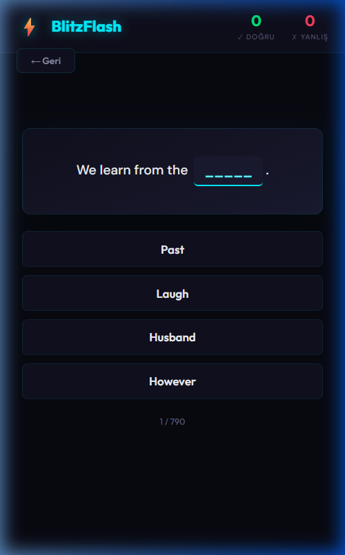

# ⚡ BlitzFlash - İngilizce Kelime Öğren

Hızlı ve eğlenceli bir şekilde İngilizce kelime öğrenmeni sağlayan interaktif flashcard uygulaması.



## 🎮 Oyun Modları

### 📚 Serbest Mod
Süre baskısı olmadan kendi hızında çalış. Flashcard'ları çevirerek kelimelerin İngilizce ve Türkçe karşılıklarını öğren.

- **Kart çevirme**: Tıkla veya Space/Enter tuşuna bas
- **Bildim**: Sağa kaydır (dokunmatik veya mouse ile sürükle) veya → ok tuşu
- **Bilemedim**: Sola kaydır (dokunmatik veya mouse ile sürükle) veya ← ok tuşu
- Sürükleme sırasında kart hareket eder ve yön göstergeleri aktif olur
- Tüm kelimeler bittiğinde doğruluk yüzdesi gösterilir



### ⌨️ Yazarak Tahmin (60 Saniye Modu)
60 saniyede kaç kelime bilirsin? Gösterilen kelimeye çevirisini yazarak cevap ver.

- Rastgele İngilizce veya Türkçe kelime gösterilir
- Çevirisini yazıp **Enter** veya **Kontrol Et** butonuna bas
- İlk cevabınla birlikte **60 saniyelik geri sayım** başlar
- Cevap verdikten sonra kart üzerinde hem **İngilizce hem Türkçe** kelime ve cümle gösterilir
- Birden fazla anlamı olan kelimeler için herhangi birini yazmak yeterli
- Süre dolduğunda doğru sayın **skor** olarak kaydedilir
- **🏆 Skor Tablosu**: En iyi 10 skorun localStorage'da saklanır



### 📝 Cümle Tamamla
Boşluklu İngilizce cümlelerde doğru kelimeyi 4 seçenek arasından bul.

- Cümledeki boş kelimeyi tahmin et
- Doğru/yanlış cevaptan sonra Türkçe çeviri gösterilir
- Seçeneklerin altında Türkçe anlamları da listelenir



### 🧩 Kelime Avı
3 sütunlu grid'de İngilizce ve Türkçe karışık kelimelerin çevirilerini yaz.

- **30 kelime**, 3'erli sıralarla grid halinde dizilir
- Her kelime rastgele İngilizce veya Türkçe gösterilir (EN/TR badge)
- Kelimeye tıkla → açılan modalda çevirisini yaz
- **3 hak (❤️❤️❤️)**: İlk seferde doğru = **+3 puan**, 1 yanlış sonra doğru = **+2**, 2 yanlış sonra doğru = **+1**
- 3 hakkı da bitirirsen = **-1 puan** ve doğru cevap gösterilir
- Doğru bilinen kartlar **yeşile** döner, başarısız olanlar **kırmızı** + üstü çizili olur

## 📊 Kelime Havuzu

Toplam **790 kelime** — BBC 800 Essential Word List temel alınarak hazırlanmış, örnek cümleler ve Türkçe karşılıklarıyla birlikte.

| Dosya | İçerik |
|-------|--------|
| `words.js` | 176 İşlevsel kelime (the, which, and, because, vb.) |
| `words_part1.js` | Sub-list 1-2 (know, go, again, kind, vb.) |
| `words_part2.js` | Sub-list 3-4 (problem, love, company, care, vb.) |
| `words_part3.js` | Sub-list 5-6 (fine, food, thinking, stay, vb.) |
| `words_part4.js` | Sub-list 7-8 (rest, situation, thanks, instead, vb.) |
| `words_part5.js` | Sub-list 9-10 (finally, letter, president, standard, vb.) |
| `words_part6.js` | Sub-list 11-12 (approach, pressure, kill, design, vb.) |
| `words_part7.js` | Sub-list 13 (television, trust, original, vb.) |

Her kelime objesi şu bilgileri içerir:
```javascript
{
    english: "Word",
    turkish: "Kelime",
    englishSentence: "Example sentence with the word.",
    turkishSentence: "Kelimeyi içeren örnek cümle."
}
```

## 🛠️ Teknolojiler

- **HTML5** — Sayfa yapısı
- **CSS3** — Dark tema, glassmorphism, animasyonlar
- **Vanilla JavaScript** — Oyun mantığı, localStorage
- **Google Fonts** — Outfit & DM Sans font aileleri

## 🎨 Tasarım Özellikleri

- 🌙 Premium koyu tema
- 🔮 Glassmorphism efektleri ve gradient orb animasyonları
- ✨ Kart çevirme, kaydırma ve geri bildirim animasyonları
- 📱 Mobil uyumlu (responsive) tasarım
- 👆 Dokunmatik ve mouse sürükleme desteği

## 🚀 Kurulum

Herhangi bir bağımlılık veya build adımı yok. Doğrudan çalışır:

```bash
# Projeyi klonla
git clone <repo-url>

# index.html dosyasını tarayıcıda aç
start index.html
```

## 📁 Dosya Yapısı

```
BlitzFlash/
├── index.html          # Ana sayfa
├── style.css           # Tüm stiller
├── app.js              # Oyun mantığı
├── words.js            # Ana kelime listesi
├── words_part1-7.js    # Ek kelime paketleri
├── screenshots/        # Ekran görüntüleri
└── README.md           # Bu dosya
```

## 📝 Lisans

Bu proje kişisel eğitim amaçlı geliştirilmiştir.
